# 
Image Classification API Stress Test

## Hardwapre Specs
This stress test has been executed in an Ubuntu virual machine with a Windows host.

### Host Machine
+ **Operative System:** Windows 10 Home 64-bit Version 21H2
+ **Processor:** 11th Gen Intel(R) Core(TM) i7-11800H @ 2.30GHz 
+ **Physical Cores:** 8
+ **Installed RAM:** 16 GB 3200 MHz

### Guest Machine
+ **Operative System:** Ubuntu 22.04.1 LTS
+ **Processor:** 11th Gen Intel(R) Core(TM) i7-11800H @ 2.30GHz 
+ **Physical Cores:** 4
+ **Installed RAM:** 12.1 GB 3200 MHz

## Testing
We are testing the **/predict** and **/feedback** endpoints with weights of 10 and 1 respectevely; and the **/** endpoint on start. We are also setting a random wait time between 1 and 5 seconds. All test have lasted for about two minutes after reaching the maximum number of users or until response time graph gets flat.
First, we are testing with just one gunicorn worker and then we will see if there is any inpact by incressing the number of workers.

# 
---

## 
Test #1

**Number of users:** 10 
**Spawn rate:** 1

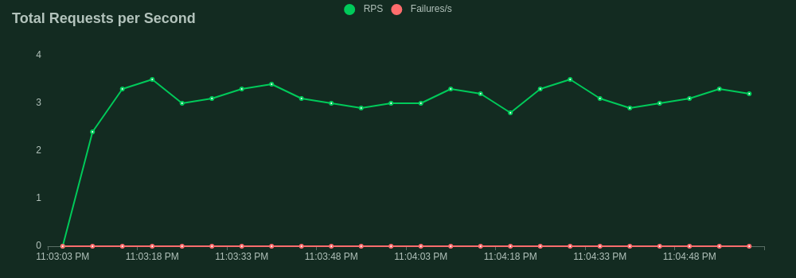

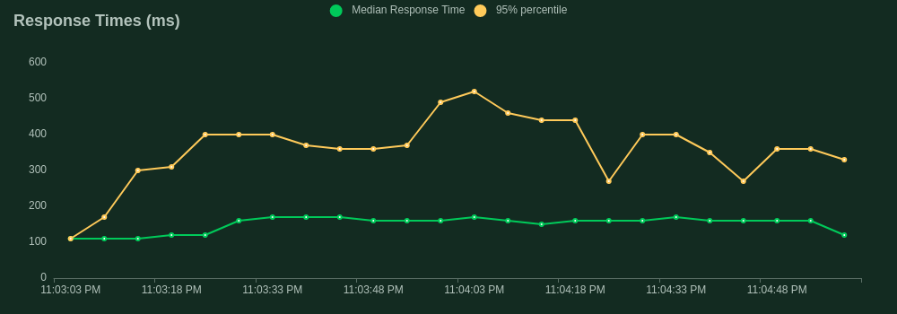

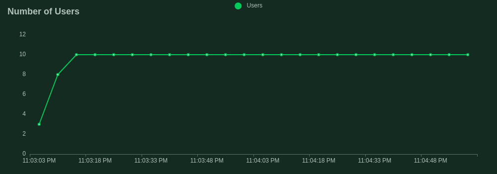

We see we got the maximun number of users in just 10 seconds. The average requests per second is 3.4 and the median response time was about 150ms. There were any failure.

The number of requests per seconds is too low primarly because of the wait time. 
For the next tests, we are only focusing in request per second and median response time graphs. You can check the complete report [here](./reports/test_1.html) (Open it in your favorite web browser)

#

## 
Test #2

**Number of users:** 50 
**Spawn rate:** 10

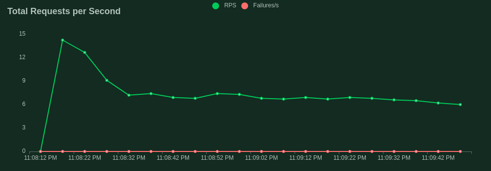

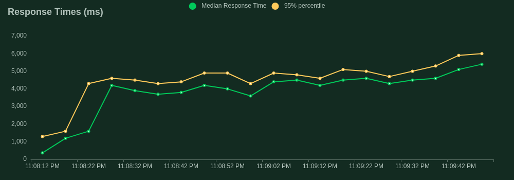

As the ratio between Number of users and Spawn rate is lower now, we have reached the maximun number of user in just 5 seconds. The average requests per second is 6.1 and the median response time was about 5400ms. The requests per second is still being limited by the wait time. 
You can check the complete report [here](./reports/test_2.html) (Open it in your favorite web browser)

#

## 
Test #3

**Number of users:** 200 
**Spawn rate:** 10

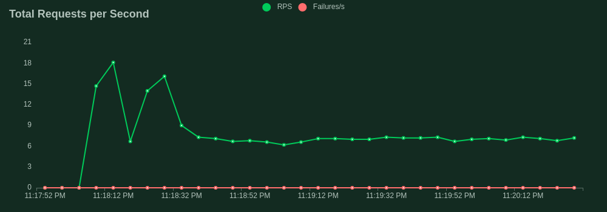

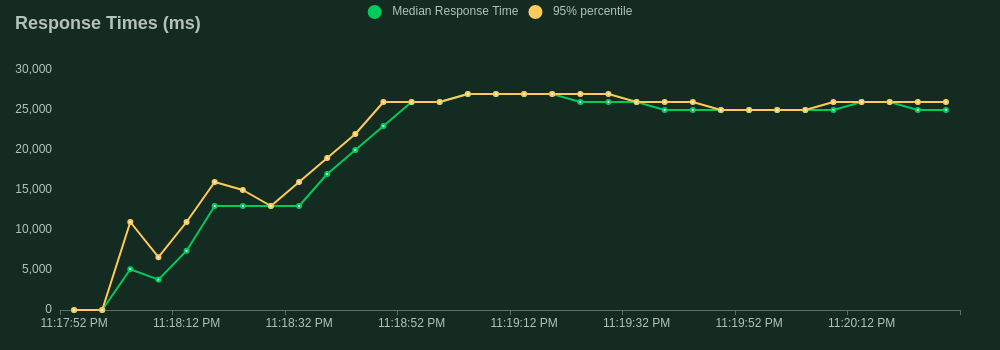

We have reached the maximun number of users in 20 seconds. The average requests per second is 7 and the median response time was about 25000ms. We had a peak of 18 rps while initializing. We are getting to start being limited by the response time if our machine learning service. We expect similar rps for subsequent tests. We are not getting any failure yet. 
You can check the complete report [here](./reports/test_3.html) (Open it in your favorite web browser)

#

## 
Test #4

**Number of users:** 500 
**Spawn rate:** 20

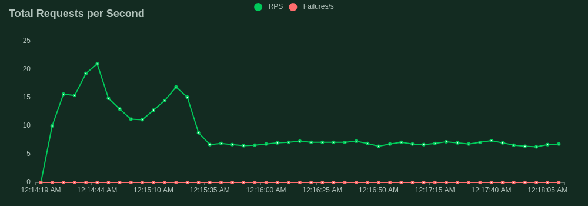

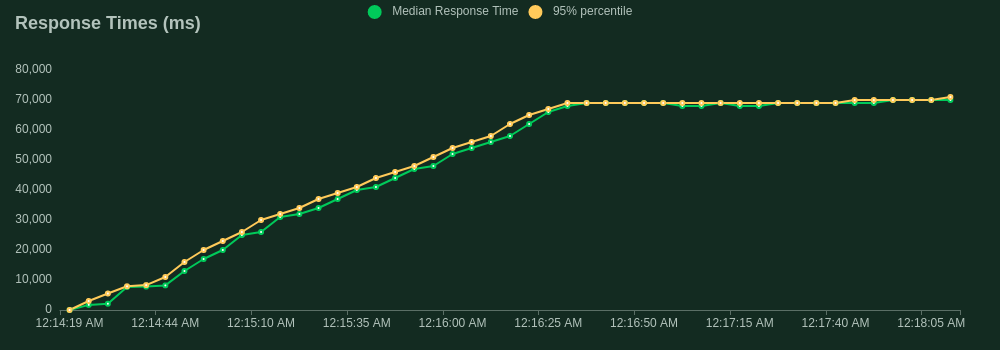

We have reached the maximun number of users in 25 seconds. As expected we are having similar average requests per second: 6.8 and the median response time was about 70000ms. We had a peak of 23 rps while initializing. We will keep increasing progressively the number of users and report the next test with a rps variation. We are not getting any failure yet. 
You can check the complete report [here](./reports/test_4.html) (Open it in your favorite web browser)

#

## 
Test #5

**Number of users:** 1500 
**Spawn rate:** 150

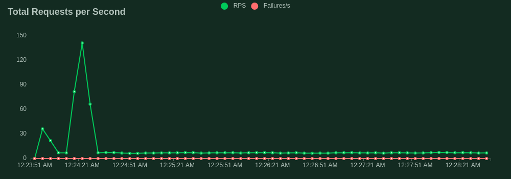

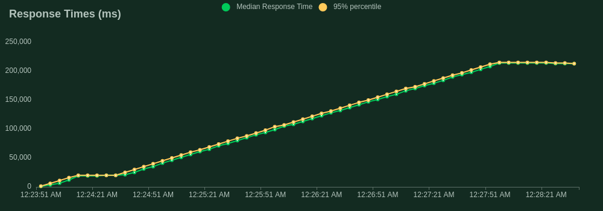

We have reached the maximun number of users in 10 seconds. We are having similar average requests per second: 6.9 and the median response time was about 213000ms. We had a peak of 78 rps while initializing and an unexpected peak of 141 rps about 1 minute later (There are some differences between the real time chart and the donwloaded graphs). We are not getting any failure yet. 
You can check the complete report [here](./reports/test_5.html) (Open it in your favorite web browser)

#

## 
Test #6

**Number of users:** 3000 
**Spawn rate:** 150

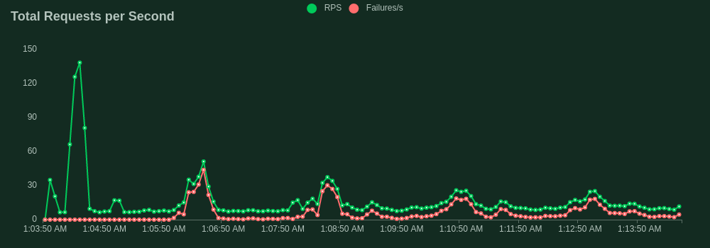

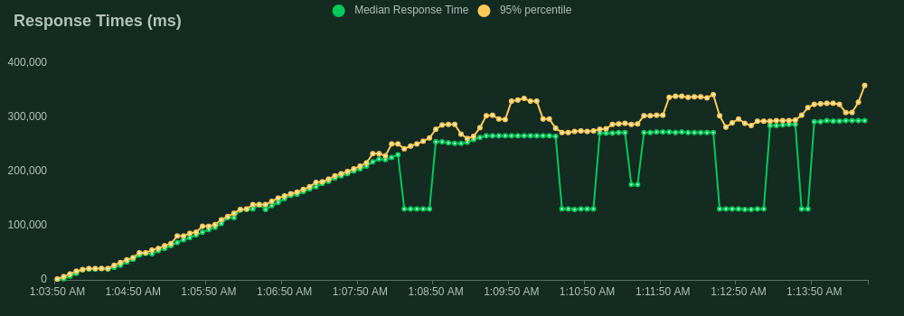

We have reached the maximun number of users in 20 seconds. 
We are having in average higher requests per seconds ranging from 8 to 37; this is because we started having some failures, and the median response time was about 294000ms. We had a peak of 64 rps while initializing and an unexpected peak of 148 rps about 1 minute later. 

Reported failures
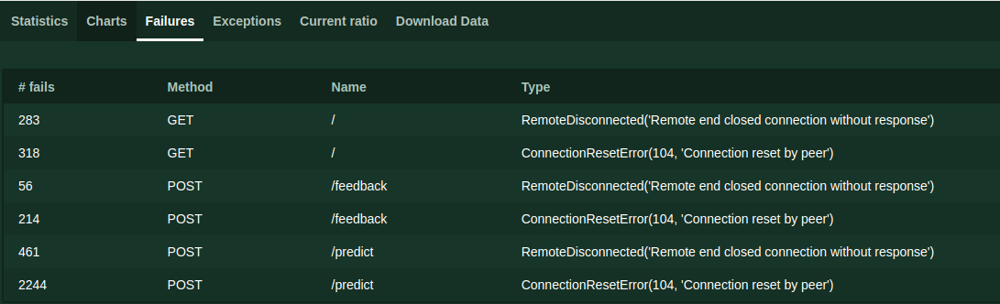

We had some logs in the terminal from our **redis** container  

redis-1  | 1:M 07 Nov 2022 01:08:03.026 * 100 changes in 300 seconds. Saving... 
redis-1  | 1:M 07 Nov 2022 01:08:03.026 * Background saving started by pid 19 
redis-1  | 19:C 07 Nov 2022 01:08:03.029 * DB saved on disk 
redis-1  | 19:C 07 Nov 2022 01:08:03.029 * RDB: 0 MB of memory used by copy-on-write 
redis-1  | 1:M 07 Nov 2022 01:08:03.128 * Background saving terminated with success 
... 
redis-1  | 1:M 07 Nov 2022 01:13:04.077 * 100 changes in 300 seconds. Saving... 
redis-1  | 1:M 07 Nov 2022 01:13:04.078 * Background saving started by pid 20 
redis-1  | 20:C 07 Nov 2022 01:13:04.081 * DB saved on disk 
redis-1  | 20:C 07 Nov 2022 01:13:04.081 * RDB: 0 MB of memory used by copy-on-write 
redis-1  | 1:M 07 Nov 2022 01:13:04.179 * Background saving terminated with success 

And can be the cause of some of the errors, by doing a search we see that we can cahnge this automatic saving (snapshot) in redis configuration.

We have also noticed almost 100% RAM bussy when this happens
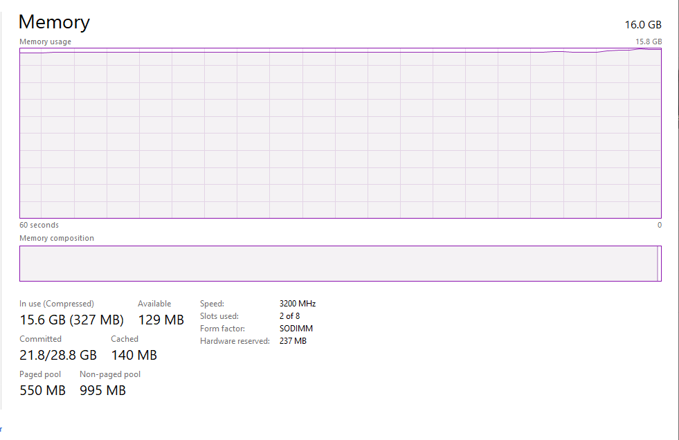

You can check the complete report [here](./reports/test_6.html) (Open it in your favorite web browser)

---

Until now we were making the tests having only one gunicor worker active, but the main process is made by the ml_service container. So increasing the number of workers should not represent any improvement. Lets see our case for 1500 users now with 2 and 4 workers.

#

## 
Test #7

**Number of users:** 1500 
**Spawn rate:** 150 
**gunicorn workers:** 2

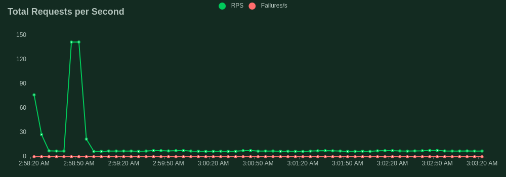

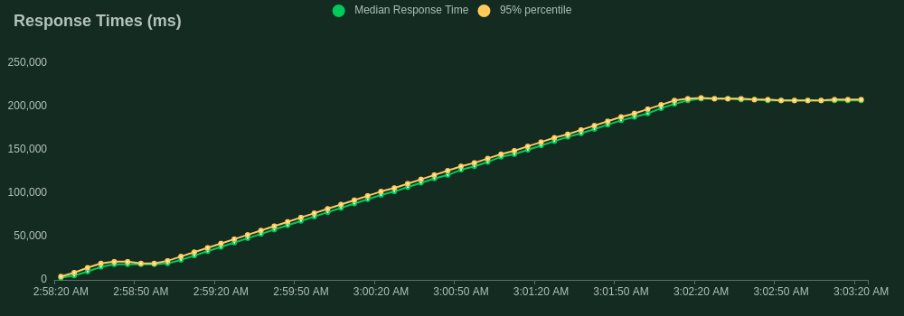

We have reached the maximun number of users in 10 seconds. We are having similar average requests per second: 6.9 and the median response time was about 207000ms. We had a peak of 77 rps while initializing and an unexpected peak of 141 rps about 1 minute later (There are some differences between the real time chart and the donwloaded graphs). We are not getting any failure. 
You can check the complete report [here](./reports/test_7.html) (Open it in your favorite web browser)

#

## 
Test #8

**Number of users:** 1500 
**Spawn rate:** 150 
**gunicorn workers:** 4

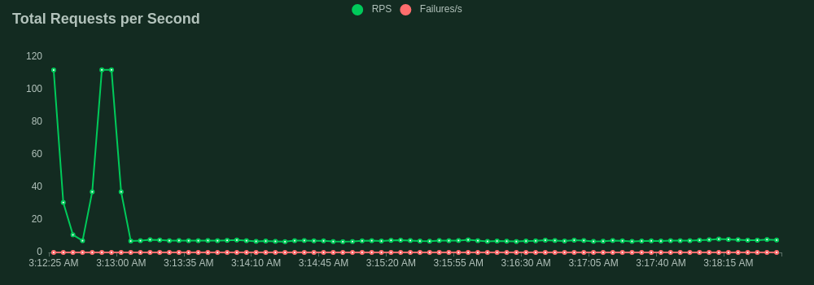

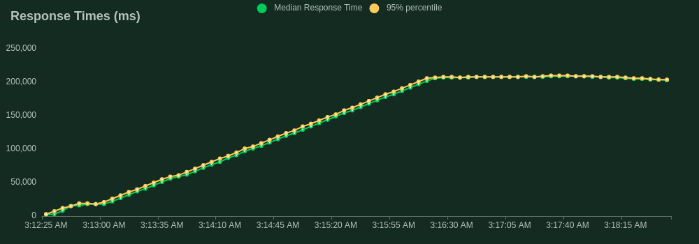

We have reached the maximun number of users in 10 seconds. We are having similar average requests per second: 7.7 and the median response time was about 208000ms. We had a peak of 127 rps while initializing. We are not getting any failure. 
You can check the complete report [here](./reports/test_8.html) (Open it in your favorite web browser)

As was mentioned. number of workers has any impact in the test.

---

Totally different should be if we scale our model servive. 

## 
Test #9

**Number of users:** 1500 
**Spawn rate:** 150 
**model services:** 2

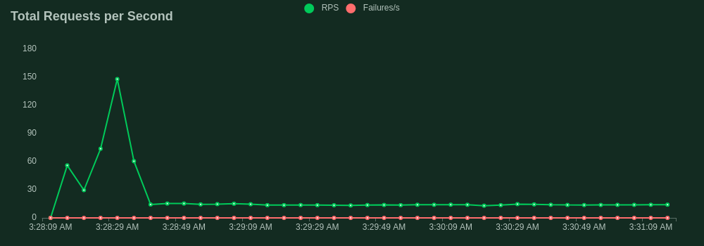

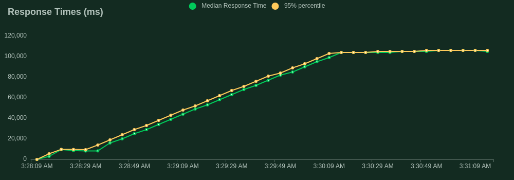

We have now 14 requests per second, and the median response time is 106000ms. So having two running services of the model effectively dobles the rps and reduces the median response time by a half.
